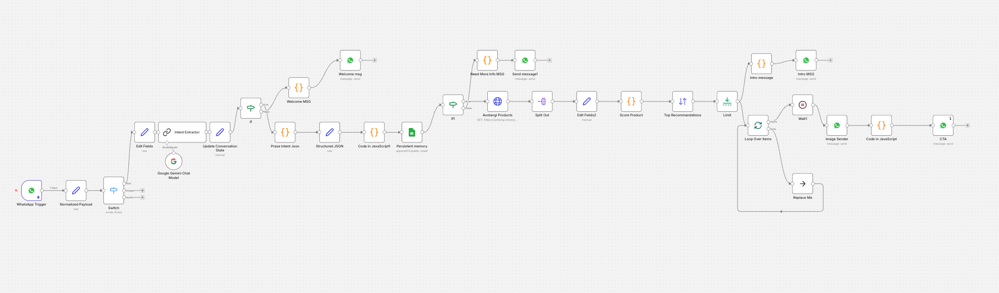
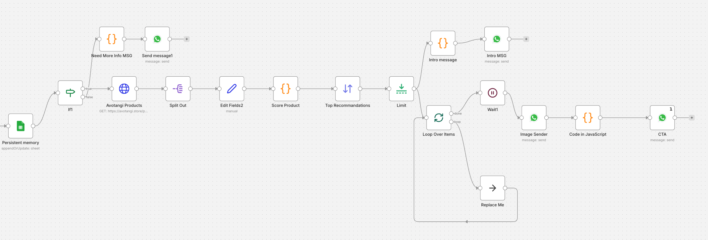

```mermaid
flowchart LR
    A[User on WhatsApp] --> B[WhatsApp Trigger]
    B --> C[Normalize Payload]
    C --> D[AI Intent Extraction]
    D --> E[Update Conversation State]
    E --> F[Persistent Memory]
    F --> G[Fetch Products]
    G --> H[Score Products]
    H --> I[Top Recommendations]
    I --> J[Send WhatsApp Messages]
```

# Avotangi WhatsApp AI Stylist 🤖👞


An AI-powered conversational commerce workflow built with **n8n** that delivers personalized luxury footwear recommendations directly through WhatsApp.

This project demonstrates how a modern D2C brand can automate a concierge-style shopping experience using AI, workflow automation, and real-time product data.

---

## ✨ Project Overview

Traditional e-commerce browsing is often overwhelming and impersonal. This system shows how brands can shift toward **guided conversational selling**, where customers simply message their needs and receive curated recommendations instantly.

With this workflow, the system can:

* 📲 Understand customer intent from natural chat
* 🧠 Extract structured preferences using AI
* 💾 Remember returning users
* 🎯 Recommend the most relevant products
* 💬 Maintain a premium, human-like tone

---

## 🏗️ Architecture Overview



---

## 🔄 End-to-End Flow

1. User sends a message on WhatsApp
2. n8n receives and normalizes the payload
3. Gemini extracts customer preferences
4. Preferences are stored in Google Sheets
5. Shopify products are fetched live
6. Products are scored against user needs
7. Top matches are sent back via WhatsApp
8. Follow-up message encourages further engagement

---

## 🧠 AI Preference Extraction

The system converts free-form chat into structured data.

**Fields extracted**

* occasion — daily, office, travel, festive, casual, formal
* style — minimal, premium, bold, classic
* comfort_needs — comfortable, cushioned, soft, lightweight
* colors — detected color mentions
* budget_hint — low, mid, premium

**Example**

User message:

> I want comfortable shoes for daily office use

AI output:

```json
{
  "occasion": "daily",
  "style": "",
  "comfort_needs": "comfortable",
  "colors": [],
  "budget_hint": "mid"
}
```

---

## 🎯 Product Ranking Logic

Each product is scored using rule-based matching.

| Criteria              | Score |
| --------------------- | ----- |
| Occasion match        | +3    |
| Style match           | +2    |
| Comfort match         | +2    |
| Avotangi vendor bonus | +1    |

Products are sorted by score and the **top 3 recommendations** are sent to the user.

---

## 🚀 Key Features

### Core capabilities

* WhatsApp conversational interface
* AI-powered intent extraction
* Persistent customer memory
* Automated product ranking
* Multi-message recommendation flow
* Error-tolerant JSON parsing

### Advanced workflow behavior

* Conditional fallback when intent is weak
* Batch product delivery with loop control
* Delay handling to avoid WhatsApp rate limits
* Clean payload normalization layer

---

## 📸 Workflow Preview

### Full Workflow



### Recommendation Flow


### Sample WhatsApp Output


---

## 🛠️ Technology Stack

**Automation**

* n8n

**AI**

* Google Gemini

**Messaging**

* WhatsApp Business API

**Commerce**

* Shopify product feed

**Memory Layer**

* Google Sheets

---

## ⚙️ Quick Start

1. Import `whatsapp_input_processor_safe.json` into n8n
2. Configure required credentials
3. Replace placeholder IDs
4. Activate the workflow
5. Send a test WhatsApp message

📘 For detailed instructions, see the setup guide below.

---

## 📚 Additional Documentation

* 📄 [Problem Statement](docs/PROBLEM_STATEMENT.md)
* 🛠️ [Setup Guide](docs/SETUP_GUIDE.md)

---

## 🔐 Security Notes

**Already implemented**

* Credentials removed from repository
* No API keys exposed
* Structured parsing with error handling

**Recommended for production**

* Hash phone numbers before storage
* Restrict Google Sheet access
* Add monitoring and alerting
* Implement stronger rate limiting

---

## 🚧 Current Limitations

* Optimized primarily for text input
* Image and audio branches are scaffolded but not fully implemented
* Product scoring is rule-based
* Google Sheets is not ideal for massive scale
* Requires WhatsApp Business approval

---

## 🔮 Future Improvements

* Image understanding for visual preference matching
* Audio transcription and intent extraction
* Vector-based semantic product search
* Multilingual support
* Customer lifetime value tracking
* Real-time inventory filtering

---

## 💼 Real-World Use Cases

**Luxury D2C brands**

* personalized product discovery
* WhatsApp concierge shopping
* clienteling automation

**E-commerce stores**

* guided selling
* preference capture
* repeat customer personalization

**Fashion and footwear brands**

* style-based recommendations
* occasion-based selling
* premium conversational experience

---

## 👨‍💻 Author

**Dinesh**

If you found this project useful, consider giving the repository a star.

---

## 📜 License

This project is provided for educational and demonstration purposes. Replace credentials and implement proper data protection before production deployment.
